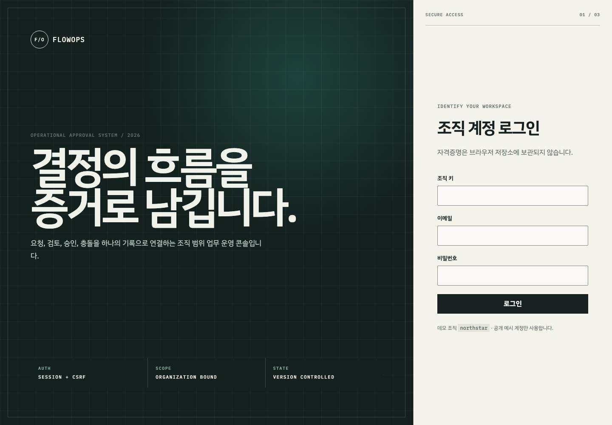
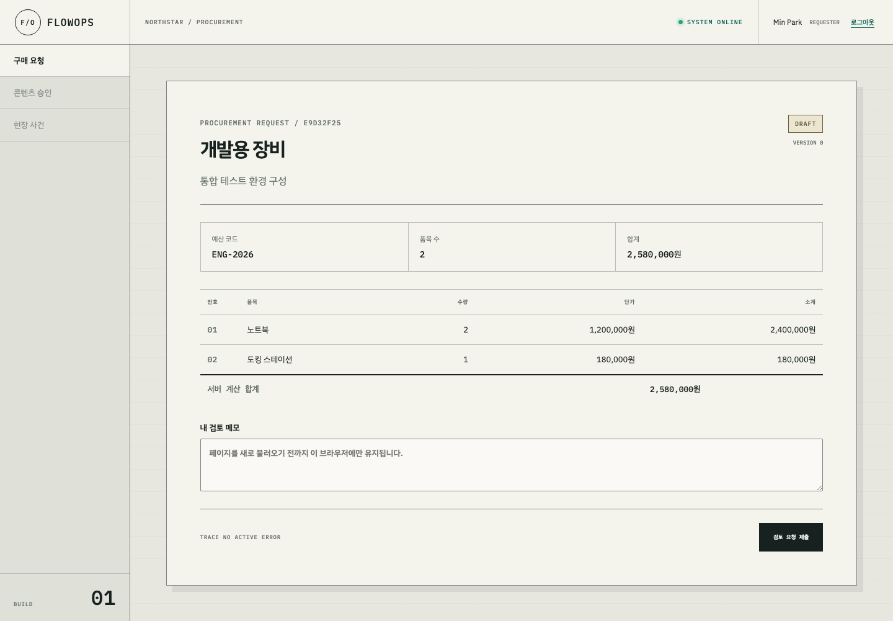

# FlowOps

[](https://github.com/Egoistian/flowops/actions/workflows/ci.yml)

FlowOps는 Java 17, Spring Boot 3.5, PostgreSQL, React, TypeScript로 만든 독립 개발 업무 승인 포트폴리오입니다. 첫 공개 준비 범위는 구매 요청을 중심으로 조직별 인증, 서버 금액 계산, 중복 제출 방지, version 충돌, 일관된 API 오류, 실제 브라우저 검증을 연결합니다.

> 표현 경계: 이 저장소는 독립 구현과 로컬 검증 증거입니다. 유료 고객 납품, 정규 근무 경력, 실제 운영 고객 시스템, 결제 플랫폼, 대규모 트래픽 처리 실적으로 표현하지 않습니다.





## 구현 범위

- 조직 키·이메일·BCrypt 비밀번호·서버 세션·CSRF 기반 로그인
- 다른 조직 데이터의 존재를 노출하지 않는 조직 범위 조회
- 품목 수량과 단가를 이용한 서버 총액 재계산
- 금액별 `REVIEWER → MANAGER → BUDGET_OWNER` 승인 계획
- 조직 범위 멱등성 키와 서버 계산 canonical SHA-256
- JPA version과 `REQUEST_VERSION_CONFLICT` 409 응답
- 임시 저장·제출·승인 감사 로그
- PostgreSQL 16 Testcontainers 기반 Flyway 검증
- React 구매 폼·상세 문서·충돌 안내·모바일 반응형 UI
- 빈 DB Docker Compose 실행과 Playwright 조직 격리 E2E

## 빠른 실행

> **로컬 데모 전용:** Compose 프로필은 웹 진입점을 `127.0.0.1:4173`에만 연결하고, 공개 데모 계정과 로컬 DB 기본 비밀번호를 사용하며, 같은 컴퓨터의 일반 HTTP에서 동작하도록 세션 쿠키의 `Secure` 속성을 끕니다. 이 프로필을 같은 LAN이나 공용 인터넷에 노출하면 안 됩니다. 실제 배포에서는 데모 Flyway 경로를 제거하고, 비밀정보 관리·HTTPS·Secure 쿠키를 적용한 뒤 별도의 운영 보안 검토를 거쳐야 합니다.

```bash
docker compose up --build --detach
curl -fsS http://127.0.0.1:4173/actuator/health
```

브라우저에서 `http://127.0.0.1:4173`을 엽니다.

Docker 데모 환경에서만 다음 가상 계정을 설치합니다.

| 조직 키 | 이메일 | 역할 |
|---|---|---|
| `northstar` | `requester@northstar.example.com` | 요청자 |
| `northstar` | `reviewer@northstar.example.com` | 검토자 |
| `acme` | `requester@acme.example.com` | 요청자 |

로컬 데모 비밀번호는 `demo-password`입니다. 실제 배포에서는 `classpath:db/demo`를 활성화하면 안 됩니다.

## 전체 검증

```bash
./scripts/verify-first-slice.sh
./scripts/check-local-demo-network.sh
./scripts/check-no-browser-auth-storage.sh
./scripts/check-public-safety.sh
```

검증 스크립트는 로컬 네트워크 노출 검사, 백엔드 테스트, 프론트 lint·테스트·빌드, 컨테이너 health, Playwright를 실행합니다. 공개 안전 검사는 현재 파일과 전체 Git 이력에서 개인 이메일, 사용자 홈 경로, 자격증명 형태, 내부 수익 작업 파일, 로그, `.env`, 브라우저 trace를 찾습니다.

## 개발 중 재현한 문제

[INC-001](docs/incidents/INC-001-concurrent-approval.md)은 오래된 승인 version을 구현하는 과정에서 승인 단계 자식 행의 ID를 잃어 고유 제약을 위반한 문제를 기록합니다. 실제 고객 장애가 아니라 개발 중 테스트로 재현한 문제이며, RED·원인·대안·수정·GREEN·남은 한계를 구분합니다.

## 공개 CI 복구 사례


첫 GitHub Actions 실행은 애플리케이션과 브라우저 E2E를 통과한 뒤 Compose 안전 검사에서 실패했습니다. 로컬 macOS와 GitHub Ubuntu가 같은 도구를 서로 다른 명령 형태로 제공한 것이 원인이었습니다. [INC-002](docs/incidents/INC-002-compose-cli-portability.md)에 실패 흐름, 고찰, 기각한 해결안, plugin-only 회귀 테스트와 두 번의 원격 성공을 기록했습니다.

## 현재 한계

- 이번 공개 준비 범위에서 완성한 업무 모듈은 구매 요청입니다.
- 콘텐츠 게시와 현장관리 모듈은 설계만 완료됐습니다.
- Compose 프로필은 로컬 데모용이며, 로컬 전용 비밀번호·루프백 HTTP·세션 쿠키 `Secure=false`를 의도적으로 사용하므로 운영 배포 템플릿이 아닙니다.
- 실결제·환불·정산·의료 데이터·산업 장비 연동은 없습니다.
- 공개 프로덕션 배포, 사용자 수, 가동률, 고객 검수, 계약, 지급, 수익 증거는 없습니다.
- 공개 `main`은 GitHub Actions에서 검증합니다. 로컬 검증과 현재 원격 워크플로 결과는 서로 다른 증거이며, 최신 상태는 연결된 Actions 기록에서 확인합니다.

## 공개와 라이선스

이 프로젝트는 [MIT 라이선스](LICENSE)로 배포됩니다. 공개 소스 저장소는 코드가 열람 가능하다는 증거일 뿐이며, 실제 운영 배포·고객 사용·외부 검수·수익 발생을 증명하지 않습니다.
