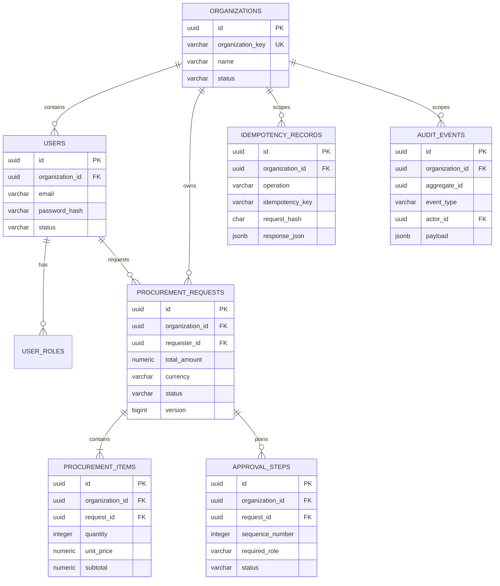

# FlowOps First-Slice ERD

Composite foreign keys bind users, requests, items, approval steps, and actors to the same organization. The application does not rely on UI filtering as a tenant boundary.
