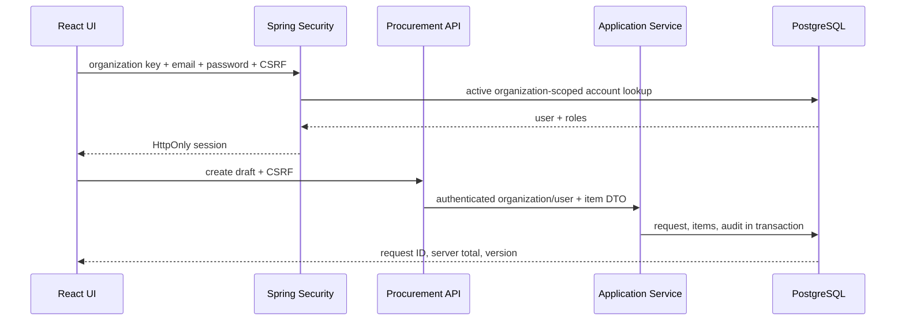

# FlowOps Module Map

```text
frontend
  app                 route and session composition
  features/auth       organization login UI
  features/procurement form, detail, conflict UI, API adapter
  shared/api          cookie/CSRF HTTP boundary and Problem parser

backend
  identity            session authentication and security handlers
  organization        scoped organization lookup
  workflow/domain     reusable approval plan and step snapshot
  procurement/domain  money, items, aggregate, state, policy
  procurement/application transaction use cases and stable exceptions
  procurement/api     authenticated HTTP mapping and validation
  procurement/query   organization-scoped read view
  procurement/infrastructure JPA mapping and scoped store
  shared/idempotency  replay and conflict boundary
  shared/api          trace filter and ProblemDetail mapping
  audit               append-only audit writer
```

## Dependency direction

```text
HTTP API → application → domain
                    ↘ ports/contracts
JPA/SQL adapters ──────────────────────┘
```

The domain does not import Spring MVC or JPA. Controllers never accept organization, actor, roles, status, version ownership, or server totals from untrusted fields. Application services own transactions. Persistence loads by `(organizationId, requestId)` and maps existing child rows in place.

## Request sequence


