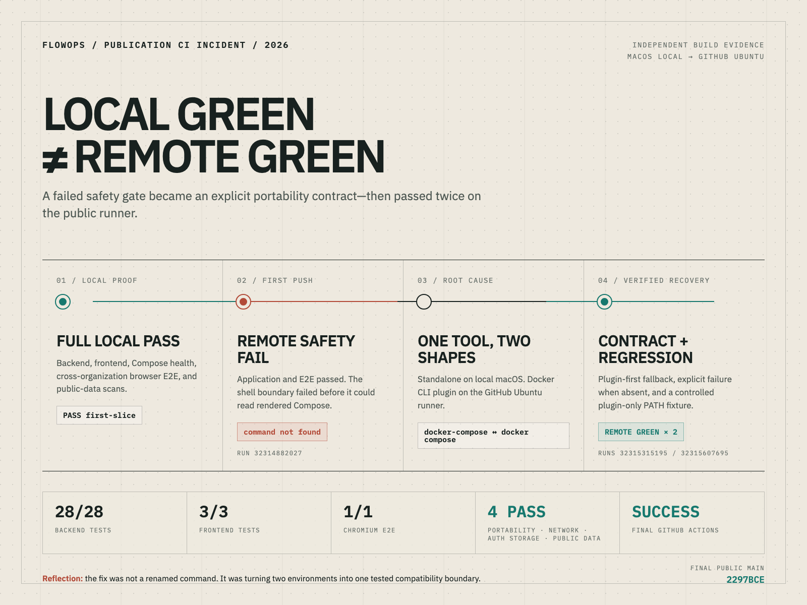

# FlowOps CI 복구 사례 / CI recovery case

## 한글 플랫폼 요약

### 제목

FlowOps — 원격 CI 환경 차이 진단과 회귀 방지

### 짧은 소개

로컬에서 통과한 Docker·Playwright 검증이 첫 GitHub Actions 실행의 공개 안전 단계에서 실패했습니다. 애플리케이션과 E2E가 원격에서도 통과했다는 점을 로그로 분리한 뒤, `docker-compose`와 `docker compose`의 설치 형태 차이를 원인으로 확인했습니다. 두 명령을 지원하는 안전 게이트와 plugin-only 회귀 테스트를 추가했고, 수정 후 최종 공개 HEAD에서 원격 CI가 두 번 연속 통과했습니다.

### 맡은 범위

- 실패 단계와 최초 오류 분리
- Compose CLI 환경 차이 재현
- 호환 가능한 검사 경계 설계
- plugin-only 실행 회귀 테스트
- 로컬 전체 재검증과 GitHub Actions 확인
- 실패·성공·남은 한계 문서화

### 문제와 해결

첫 원격 실행에서 백엔드·프런트엔드·Docker E2E는 통과했지만 안전 검사 스크립트가 GitHub에 없는 `docker-compose`를 호출했습니다. GitHub에 별도 바이너리를 설치하는 대신 스크립트가 표준 플러그인을 우선 사용하고 독립 명령으로 대체하도록 수정했습니다. 실제 plugin-only PATH에서 스크립트를 실행하는 테스트를 추가해 재발을 막았습니다.

### 검증 결과

- 백엔드 테스트 28/28
- 프런트엔드 테스트 3/3
- Chromium E2E 1/1
- Compose·브라우저 인증 저장·개인정보 안전 검사 통과
- 수정 후 GitHub Actions 2회 연속 성공

### 표현 경계

GitHub 공개 과정에서 발생한 CI 호환성 문제입니다. 고객 운영 장애, 프로덕션 복구, 대규모 트래픽, 계약, 지급 또는 수익 사례로 표현하지 않습니다.

## English platform summary

### Title

FlowOps — Remote CI portability diagnosis and regression prevention

### Short description

The locally green Docker and Playwright pipeline failed in the public-safety step of its first GitHub Actions run. I separated the passing application/E2E layers from the failing shell boundary, traced the first error to the `docker-compose` versus `docker compose` installation shape, and added a portable gate plus a plugin-only regression. Two consecutive remote workflows passed on the repaired public repository.

### Scope

- isolated the failing CI layer and first actionable error;
- reproduced the Compose CLI environment difference;
- designed a compatible safety boundary;
- added a plugin-only execution regression;
- reran the full local pipeline and remote Actions;
- documented failure, reflection, recovery, and remaining limits.

### Result

- 28/28 backend tests;
- 3/3 frontend tests;
- 1/1 Chromium E2E;
- Compose, browser-auth-storage, and public-data safety gates passed;
- two consecutive GitHub Actions runs succeeded after the fix.

### Claim boundary

This is a CI portability issue found while publishing an independent portfolio repository. It is not a customer production incident, hosted-service recovery, commercial delivery, contract, payment, or revenue claim.
